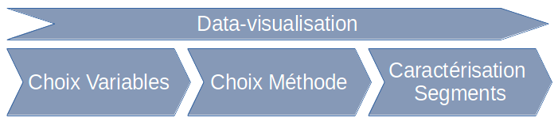

---

```{r setup, include=FALSE}
knitr::opts_chunk$set(echo = TRUE)
```

# Vue d'ensemble 

## A qui s'adresse typoChooseR ?

Pour une utilisation optimale il est préférable que l'outil soit utilisé par un data-scientist (statisticien, machine learner...) en interaction avec un spécialiste métier. 

Un utilisateur novice en statistiques peut aboutir à des typologies par tâtonnements et vérifier dans le dernier onglet qu'il parvient à interpréter les groupes obtenus, mais il existe un risque de ne pas voir que la méthodologie ne convient pas à un jeu de données particulier. 

## Quelle est la démarche générale ?

L'outil propose trois onglets, qui correspondent aux trois étapes de la segmentation

1. Choisir les variables
2. Choisir la méthode
3. Explorer les groupes obtenus

Pour chacune des étapes, la visualisation des données accompagne les choix de l'utilisateur



## Quel type de données et quel format d'entrée ?

### Type de données
Développé dans le cadre de la chaire Data-Connaissance Client, cet outil s'appuie sur des données qualitatives, catégorielles (pays, profession, type de marché). Pour prendre en compte des variables quantitatives il suffit de les *discrétiser*, c'est à dire de les classer par tranche, par exemple par intervalle de même fréquence (quantiles).

### Format csv
Pour le moment, afin de ne pas surcharger l'interface, typoChooseR ne prend en entrée que des fichiers csv, dont les champs doivent être séparés par des points-virgules (";").
Les modalités des variables catégorielles peuvent être encadrées par des guillemets doubles. 

### Volume
#### Nombre de variables
Les choix des variables et l'interprétation des résultats reposent sur des représentations visuelles. Ainsi, si le nombre de variable est très élevé, les représentations seront moins lisibles. 
#### Nombre d'individus
L'outil typoChooseR sert à explorer différentes méthodes. Le langage de programmation sur lequel il repose, R, travaille "en mémoire", et la limite des données qu'il peut charger dépendra donc de la machine sur lequel il est utilisé. Cependant, dans les onglets de choix de variables ou de méthodes, un curseur permet de choisir la taille de l'échantillon qu'on utilise pour effectuer l'analyse. 
Si le fichier n'est pas trop gros, ou conclura l'analyse en choisissant la totalité du jeu de données. Dans le cas de jeux de données plus volumineux, on pourra répliquer l'analyse choisie avec des technologies de production plus robustes à la volumétrie. 


## Quel format de sortie ?
Une fois que l'utilisateur est parvenu à une segmentation/typologie qui lui convienne, il peut exporter un fichier au format csv. Ce fichier contient les variables initiales ainsi qu'une variable groupe qui contient les intitulés choisis par l'utilisateurs pour chacun des segments qu'il a définis.

## Quels packages charger dans R prou l'utiliser ?

L'implémentation des algorithmes et de l'interface exige qu'un certain nombre de packages soient installés dans votre distribution R. Le code ci-dessous permet d'installer l'ensemble des packages nécessaires à l'exécution de l'application shiny dans R-Studio.

```{r eval=FALSE}
packages_a_installer<-c(
  "shiny","shinythemes","shinycssloaders","shinyBS","shinyWidgets","FactoMineR","mclust",
  "fields","vcd","MixAll","clusterCrit","ggplot2","ggrepel","reshape2","gridExtra","DT")
install.packages("packages_a_installer")  

```


# Premier onglet : choisir les variables
Le premier onglet se décompose en trois partie. 

## Panneau de gauche : charger et choisir

Le panneau de gauche, permet de choisir le fichier à charger ainsi que les variables qu'on souhaite conserver pour la construction de la typologie. Les variables non retenues seront conservées dans le jeu de données mais ne participeront pas à la construction des groupes. 


Un curseur permet de choisir la taille de l'échantillon utilisé pour calculer les graphiques du panneau central. Un échantillon plus grand représentera mieux la réalité du jeu de données mais exigera un temps de calcul plus important. 

## Panneau central

### Données manquantes
S'il existe des données manquantes, une interface conditionnelle apparaît pour proposer de supprimer les lignes correspondantes ou de créer une colonne "inconnu" pour les colonnes concernées. La gestion fine des données manquantes, comme la discrétisation des variables continues et l'ensemble de la préparation des données doit être traité en amont.

### Représentation résumée des modalités : plan factoriel d'une analyse des correspondances
Le premier graphique du panneau central présente le premier plan d'une analyse factorielle des correspondances multiples réalisée à partir des variables choisies. Sans entrer dans les détails techniques, ce premier plan est celui qui représente avec le moins de perte d'information quelles modalités des variables choisies sont proches ou éloignées, c'est à dire lesquelles sont portées par les mêmes individus ou non. 

### Lien ou corrélation entre les variables : V de Cramer
Retenir plusieurs variables liées entre elles revient à surpondérer ou survaloriser l'information portée par ces variables. Le deuxième graphique du panneau central permet de choisir des variables pas trop liées entre elles. Toutes les variables sont représentées en abscisse et en ordonnées, au croisement de deux variables, la couleur de la case indique le lien (au sens de l'écart à l'indépendance mesuré par le V de Cramer) entre les deux variables. 

Il est possible de cocher ou décocher toutes les variables. 


### Itération

Chaque fois que l'utilisateur décide de supprimer ou d'inclure des variables, il clique sur l'un des boutons "Appliquez les choix". L'onglet est actualisé et l'utilisateur peut choisir de modifier son choix ou, s'il est satisfait, de passer à l'onglet suivant (en cliquant dessus dans la barre supérieure).


# Deuxième onglet : choisir la méthode et construire les groupes

Comme pour le premier onglet, un curseur permet de choisir la taille de l'échantillon utilisé pour explorer le type d'algorithme utilisé pour segmenter la population. Plus l'échantillon est grand, plus le résultat est fiable et sera proche de celui qu'on obtiendra sur l'ensemble du jeu de données, mais plus les calculs sont lents, voire impossible si la machine utilisée est peu puissante (mémoire et CPU). On recommande d'ajuster les paramètres sur un échantillon de taille modéré et de l'agrandir lorsqu'on pense avoir cerné les bons paramètres. 


## Choix de l'algorithme

Trois algorithmes sont possibles : 
* K-means
* Modèle de mélange
* Mixte : K-means+CAH (déconseillé)

Le menu déroulant "méthode de partitionnement"" permet de choisir l'algorithme utilisé. 

Les algorithmes ne sont ici évoqués que brièvement, pour guider le choix de l'utilisateur.

### K-moyennes (ou K-means)

L'algorithme K-means, en français K-Moyennes fonctionne de la façon suivante. 
Après avoir choisi le nombre de groupe, on initialise des centre de classes au hasard. On constitue des classes provisoires en affectant chaque individu du jeu de données au centre le plus proche. 
Puis on recalcule les centres des classes ainsi constituées. 
On itère les deux étapes précédentes à partir de ces centres, jusqu'à convergence, c'est à dire jusqu'à ce que les centre des classes ainsi constituées restent stables. 


#### Avantages des K-Means
* L'algorithme est facile à comprendre
* Les temps de calcul sont raisonnables
# La notion de distance est à préciser quand il s'agit de variables qualitatives

#### Inconvénients des K-Means
* L'algorithme recherche des classes "sphériques", il ne peut prendre en compte des formes spécifiques 
* L'initialisation aléatoire peut entraîner un risque d'instabilité (qu'on peut compenser en effectuant plusieurs initialisation)

### Modèle de mélange

Dans le cas du modèle de mélange, on fait l'hypothèse que, dans chaque classe, les données suivent une loi de distribution spécifique. L'algorithme doit alors estimer les paramètres de la loi de distribution par classe, puis affecter chaque individu à la classe à laquelle il est le plus probable qu'il appartienne. 
L'estimation des paramètres et de cette probabilité d'appartenance a posteriori se fait grâce à un algorithme Expectation-Maximisation. 

#### Avantages du modèle de mélange
* L'algorithme permet de prendre en forme des liens différents entre les variables selon les classes : il permet *d'attraper* des classes de forme non sphériques
* Le temps de calcul reste inférieur à celui d'une CAH pour les grands échantillons
* Travaille à partir des variables initiales, sans passer par l'analyse factorielle

#### Inconvénients des modèles de mélange
* Le temps de calcul est plus long que pour les K-Means
* L'aspect modélisation est plus difficile à expliquer à des non-spécialistes que les K-Means

### K-means + CAH (déconseillé)

La classification ascendante hiérarchique est une méthode de classification populaire et bien adaptée aux petits jeux de données. Elle fonctionne de la façon suivante. A l'initialisation chaque individu est considéré comme une classe. A chaque étape on regroupe les classes les plus "proches" selon un critère d'agrégation choisi. 

La CAH demande, dès la première étape, de calculer les distances entre toutes les paires de points possibles. Elle est donc totalement inadaptée pour les jeux de données de grande taille. 

La classification mixte consiste à réduire le nombre de points utilisés pour la CAH en effectuant d'abord un K-Means avec un nombre de classes grand par rapport au nombre de classes final mais petit par rapport au nombre d'individus. 

#### Avantage de la classification mixte
* Elle permet d'obtenir un dendrogramme, c'est à dire une représentation des fusions successives de classes afin de choisir visuellement le nombre de classe. Cette représentation n'est pas implémentée dans l'outil. 
* Elle permet de choisir différents critères d'agrégation pour prendre en compte la forme des classes

#### Inconvénients de la classification mixte
* Elle reste consommatrice de ressource
* Le choix du nombre de centres dans l'étape K-means est empirique
* Le résultat est souvent instable. Des études complémentaires sont à réaliser, mais sur les jeux de données ayant servi à concevoir notre outil, les résultats étaient toujours peu stables. 

## Choix des autres paramètres

### Nombre de groupes

Un curseur permet de choisir le nombre de groupes que l'algorithme choisit doit construire. Dans les cas d'usage ayant mené au développement de typoChooseR, le nombre de groupe n'excédait pas 15 groupes (cette limitation peut être levée en modifiant le code source du fichier ui.R).
(voir plus bas l'affichage d'un critère pour le choix du nombre de groupes)

### Nombre de composantes (Méthodes géométriques)

Pour les algorithmes K-means et "mixte CAH+K-means", la distance entre les individus est la distance euclidienne calculée à partir des p premières composantes (axes factoriels) de l'ACM. Prendre toutes les composantes revient à calculer la distance du Khi2 à partir des variables qualitatives d'origine. Dans le cas où on soupçonne de la redondance d'information ou du bruit, on peut choisir de ne pas conserver toutes les composantes. 

(voir plus bas l'affichage d'un critère pour le choix du nombre de composantes)

### Plan factoriel à représenter (exploration des dimensions supérieures)

Le premier plan factoriel permet de représenter "au mieux" les individus et les modalités. Cependant, cette représentation à deux dimensions entraîne une perte d'information. Pour pouvoir explorer les plans factoriels suivants, on peut déplacer le curseur "plan factoriel supplémentaire à représenter".

# Troisième onglet : explorer les groupes, les nommer, exporter

La philosophie de typoChooseR est de choisir les paramètres des algorithmes de partitionnement en fonction de l'interopérabilité des classes obtenues à partir des variables initiales, et de leur répartition par groupe. C'est ce que propose le troisième onglet. 


## Effectifs

Le panneau central présente un tableau recensant les effectifs par groupe, en nombre et en pourcentage. Cela permet éventuellement de détecter un groupe d'effectif très différent des autres (par exemple à cause de l'influence exagérée d'outliers).
Ces effectifs sont rappelés dans l'interface de saisie de libellés de groupes. 

## Répartition des modalités par groupe

### Variables les plus liées aux groupes

Les quatre premiers graphiques sont générés automatiquement. Ils représentent la répartition des modalités par groupe pour les quatre variables les plus liées aux groupes construits (au sens du V de Cramer).

### Variables choisies par l'utilisateur

Le premier menu du panneau de gauche permet de sélectionner quatre autres variables pour lesquelles représenter la répartition des modalités par groupe. Pour retirer une variable déjà sélectionnée,  cliquer sur son nom puis la supprimer en appuyant sur la touche del ou suppr du clavier. 

Ces graphiques sont produits au format png et peuvent être exportés à l'aide d'un simple clic droit / enregistrer l'image sous. 

## Nommage des groupes

Si les groupes sont porteurs de sens, l'exploration des graphiques doit aider l'utilisateur à proposer un nom pour chaque groupe. Ce nom peut être saisi dans le panneau de gauche, dans chacune des cases affichant "saisissez un libellé".

## Export du jeu de données segmenter

Si les groupes construits sont satisfaisants, il est possible d'exporter le jeu de données augmenté d'une colonne numéro de groupe et d'une colonne libellé, reprenant les libellés saisis par l'utilisateur. 

# Utilisation avancée : nombre d'axes factoriels (composantes) et nombre de groupes

## Nombre de composantes

### Garder toute l'information ou pas ?
Pour les méthodes géométriques, typoChooseR calcule les distances à partir des premiers axes factoriels (ou composantes) de l'analyse des correspondances multiples effectuée sur les variables retenues pour faire la classification. Il n'existe pas de critère a priori pour choisir ce nombre de composantes. 

Retenir toutes les composantes revient à se baser sur la distance du Khi2. On peut l'interpréter comme un distance qui garde toute l'information contenue dans les données. 
Si plusieurs variables sont liées, c'est à dire si elles mesurent une information sous-jacente commune, cette information sera sur-pondérée dans la réalisation de la classification. 
De plus, les variables ayant plus de modalité auront plus de poids que les variables ayant moins de modalité. 

Au contraire, ne retenir que les premiers axes revient à filtrer une partie de la variabilité du jeu de données, ce qui peut être considéré comme une façon de filtrer du "bruit", c'est à dire une information dont on fait l'hypothèse qu'elle n'a pas de sens a priori. 

Enfin, il ne faut pas confondre les deux fonctions de l'Analyse Factorielle des Correspondances Multiples : la représentation t la réduction e la dimension. 

La représentation graphique de données multi dimensionnelles demande de synthétiser l'information au mieux pour la représenter dans un nombre restreint de plans factoriels (en général, un ou deux). Cela ne veut pas dire qu'il n'y a plus d'information dans les dimensions suivantes, mais seulement qu'elles expliquent moins de variabilité que les premières. 
La fonction de réduction des dimensions cherche à filtrer l'information, et exige souvent de conserver un plus grand nombre d'axes. 

### Choix du nombre d'axes

Comme il n'existe pas de critère d'optimalité, typoChooseR adopte une autre approche : réduire le nombre de classifications à explorer. Pour cela, typoChooseR propose de réaliser les classifications avec 1, 2, ... p composantes et de regarder si elles sont proches ou non. 
L'indice de Rand est un indicateur de proximité entre deux classifications. Pour le calculer, on regarde, pour chaque paire d'individus, s'ils sont classé ensemble par les deux classifications, s'ils sont classés séparément par les deux classifications. Dans ces deux cas, les classifications sont "d'accord." Si au contraire, les deux individus sont classés ensemble (dans le même groupe) par une des classifications et séparément par l'autre, alors elles divergent pour cette pair de d'individus. L'indice de Rand calcule une moyenne de cet accord pour toutes les paires d'individus. 

Lorsqu'on appuie sur le bouton "comparer les partitions" du panneau de gauche du deuxième onglet, une représentation graphique de cette proximité est produite. Ainsi, on peut voir que pour une fourchette de composantes retenues, les classifications varient peu, et on pourra alors n'en  explorer qu'une seule dans cette zone. 
On réduit ainsi le nombre de classifications à explorer. 


Le choix de la classification à retenir se fera toujours en interprétant la répartition des variables de départ part groupes, dans l'onglet 3. 

À côté de cette représentation des proximités entre composantes, un graphique permet de représenter la part d'information portée par chaque composante mesurée par la valeur propre associée à chaque composante. On remarque qu'il y a souvent un lien entre une diminution forte du nombre de composante et l'apparition d'une nouvelle zone de stabilité des classifications. 
## Nombre de groupes

La raison la plus fréquemment avancée à l'utilisation d'une classification mixte commençant par un K-means avec K grand suivi d'une CAH sur les centres est la possibilité d'obtenir un arbre, ou dendrogramme, facilitant le choix visuel du nombre de groupes à retenir. 
 
 Cette procédure nous semble avoir deux inconvénients : un manque de stabilité et un temps de calcul élevé, surtout si le nombre de K-means de la première étape reste élevé. 
 
 Dans le cas de segmentation de population client, le nombre de groupes est souvent compris entre 3 et moins de dix. Pour laisser de la marge aux utilisateurs, le curseur Nombre de groupes permet de choisir de 2 à 15 groupes. L'expert métier peut avoir un avis a priori sur le nombre de groupes à attendre et il est parfois plus rapide d'explorer les typologies dans cette fourchette de nombre de groupes. 
 Dans le cas contraire, il peut être intéressant d'explorer un indicateur statistique. Cocher la case "Basculer vers la recherche du nombre de groupes" permet d'accéder à un graphique qui aide au choix du nombre de groupes, en affichant un critère adapté à la méthode choisie. 
 
 ### Pour les K-means (et la classification mixte)
 
La silhouette est un critère qui mesure combien un individu est similaire aux autres individus de son groupe (cohésion) et différent des individus des autres groupes (séparation). Une valeur moyenne du critère pour tous les individus apporte une vision de la qualité du partitionnement. Plus le critère est élevé, plus le partitionnement est bon. 


Le calcul de ce critère est consommateur de temps de calcul, c'est pourquoi la taille de l'échantillon utilisé pour le calculer est limitée au minimum entre la taille de l’échantillon que vous avez retenu pour explorer les typo et un échantillon de 5000 individus. (Cette limite est arbitraire, dépend de la machine utilisée et peut aisément être modifiée dans le fichier server.ui, ligne 383 dans la version actuelle du code )
 
Ce critère peut présenter une certaine volatilité, aussi recommande-ton d'augmenter la taille de l'échantillon jusqu'à ce que soit les temps de calculs soient limitants, soit le nombre de groupes maximisant le critère soit stabilisé. 

### Pour les modèles de mélange

La classification par modèle de mélange fait l'hypothèse que les variables suivent une loi de distribution différente dans chaque classe. L'existence de ce modèle permet de calculer un indicateur plus statistique, le critère d'information bayésien (BIC). Plus ce critère est petit, meilleure est la classification. Comme pour les K-means, on effectue autant de classification que de nombre de groupes à tester, et on retient le nombre de groupes correspondant à une "cassure", ou "coude" dans la décroissance du critère BIC. Le temps de calcul est donc là aussi assez élevé.
L'existence d'un modèle semble permettre d'avoir une stabilité du nombre de groupes optimal avec un peu moins de données, mais là encore, il peut être plus prudent de faire varier la taille de l'échantillon pour s'assurer qu'on retombe sur le même nombre de groupes. 


Dans tous les cas, il est souvent pertinent de tester des classification avec un groupe de plus ou de moins que le nombre optimal proposé par le critère, notamment parce que des raisons métier peuvent faire préférer une classification plutôt qu'une autre. 


# Conclusion

L’application typoChooseR permet d'explorer différentes classifications pour segmenter une population d'individus sur laquelle on mesure des variables qualitatives. 
Il est possible de choisir les variables qui entrent en compte dans la réalisation de la typologie, l'algorithme de segmentation, le nombre de groupes à construire, et, pour les méthodes géométriques, le nombre de composantes d'une ACM préalable à retenir. 
Le choix de la typologie finale se fait en revenant aux variables d'origine, et en explorant graphiquement la répartition de leurs modalités (catégories) au sein des différents groupes construits. 
L'exploration peut se faire sur un échantillon réduit pour ne pas être entravé par le temps de calcul, avant de relancer l'algorithme choisi sur l'ensemble de la population. 
Le résultat de la typologie, c'est à dire les variables retenues, les groupes et le libellé qu'on leur a donnés peuvent être exportés au format csv. 
Cette application n'a pas vocation à être industrialisée dans un contexte de très grand nombre de variable/d'individus, mais permet le choix d'un algorithme et de ses paramètres, qui peuvent ensuite être implémentée dans les langages adaptées à une volumétrie plus importante. 


La distribution de cette application ressort de la GNU public license 3 (voir document de licence).
